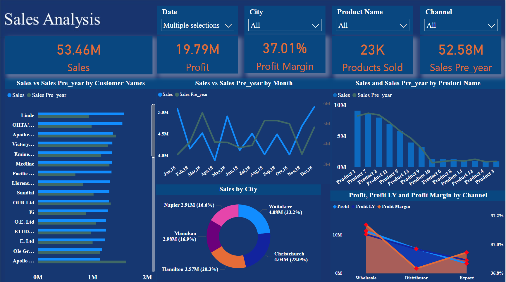

# Sales Analysis Dashboard
# Overview
 
This Sales Analysis Dashboard is designed to provide comprehensive insights into the sales performance of a company. It offers a clear visualization of key metrics such as total sales, profit, profit margin, and product sales over the previous year. The dashboard is interactive, allowing users to filter data by date, city, product name, and sales channel to get more specific insights.
 

# Key Metrics
 
<b>Total Sales</b>: The total revenue generated, displayed as 53.46M.
 
<b>Profit:</b> The total profit earned, displayed as 19.79M.
 
<b>Profit Margin:</b> The profit margin percentage, displayed as 37.01%.
 
<b>Products Sold:</b> The total number of products sold, displayed as 23K.
 
<b>Sales Previous Year:</b> The total sales from the previous year, displayed as 52.58M.
 

# Visualizations

 
Sales vs. Sales Pre_year by Customer Names
 
<b>Bar Chart:</b> This chart compares the current year's sales to the previous year's sales for each customer. It helps identify which customers have increased or decreased their purchases compared to the previous year.
 
Sales vs. Sales Pre_year by Month
 
<b>Line Chart:</b> This chart shows the monthly sales trend for the current year compared to the previous year. It helps identify seasonal patterns and trends in sales performance.
 
Sales by City
 
<b>Pie Chart:</b> This chart breaks down the total sales by city, showing the contribution of each city to the overall sales. The percentage share of each city is also displayed.
 
Sales and Sales Pre_year by Product Name
 
<b>Bar Chart:</b> This chart compares the current year's sales to the previous year's sales for each product. It helps identify which products are performing well and which ones need attention.
 
Profit, Profit LY, and Profit Margin by Channel
 
<b>Line and Bar Chart:</b> This chart compares the profit, profit from the last year (Profit LY), and profit margin across different sales channels (Wholesale, Distributor, Export). It helps analyze the profitability of each channel.
 

# Filters
 
The dashboard includes several filters to allow users to customize the view:
 
Date: Users can select specific dates or date ranges to analyze the data.
 
City: Users can filter the data by specific cities.
 
Product Name: Users can filter the data by specific product names.
 
Channel: Users can filter the data by sales channels such as Wholesale, Distributor, and Export.
 

# Usage
 
<b>Interacting with Filters:</b> Use the drop-down menus at the top of the dashboard to filter the data by date, city, product name, or sales channel. This allows for customized analysis based on specific criteria.
 
<b>Hovering Over Data Points:</b> Hover over any data point in the charts to view detailed information and tooltips.
 
<b>Analyzing Trends:</b> Use the line charts to identify trends over time, such as seasonal patterns or monthly variations in sales and profit.
 
<b>Comparing Performance:</b> Use the bar charts to compare current performance against the previous year, for both customers and products.
 

# Conclusion
 
This Sales Analysis Dashboard is a powerful tool for gaining insights into sales performance. By providing detailed visualizations and interactive filters, it enables users to make informed decisions based on comprehensive data analysis. Whether you are looking to track overall sales, analyze profit margins, or compare product performance, this dashboard provides the necessary tools to drive business success.